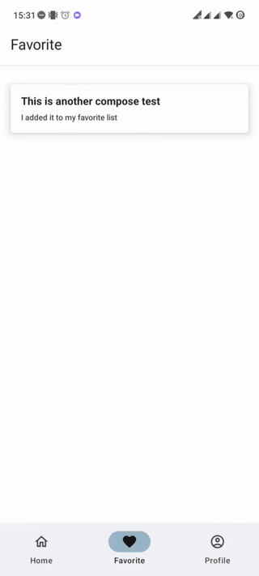

# Light Note

**Light Note** is a simple android implementation that contains several techniques and technologies such as:

- **Compose:** User Interface implemented by Jetpack Compose and has tried to have a clean structure and good performance. [read more](https://developer.android.com/develop)
- **Compose Navigation:** Used compose screens instead of fragments. [read more](https://developer.android.com/jetpack/compose/navigation)
- **Room:** Manage db with Room Persistence library. [read more](https://developer.android.com/training/data-storage/room)
- **Coroutines:** Avoid concurrency and have thread management. [read more](https://developer.android.com/kotlin/coroutines)
- **HIlt:** Used Hilt for Dependency Injection. [read more](https://developer.android.com/training/dependency-injection/hilt-android)
- **MVI:** Considered Model View Intent for implementation and separate concerns.

Also it has tried to have some test coverage for vital parts of the project.
